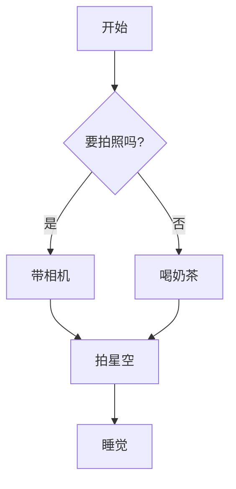
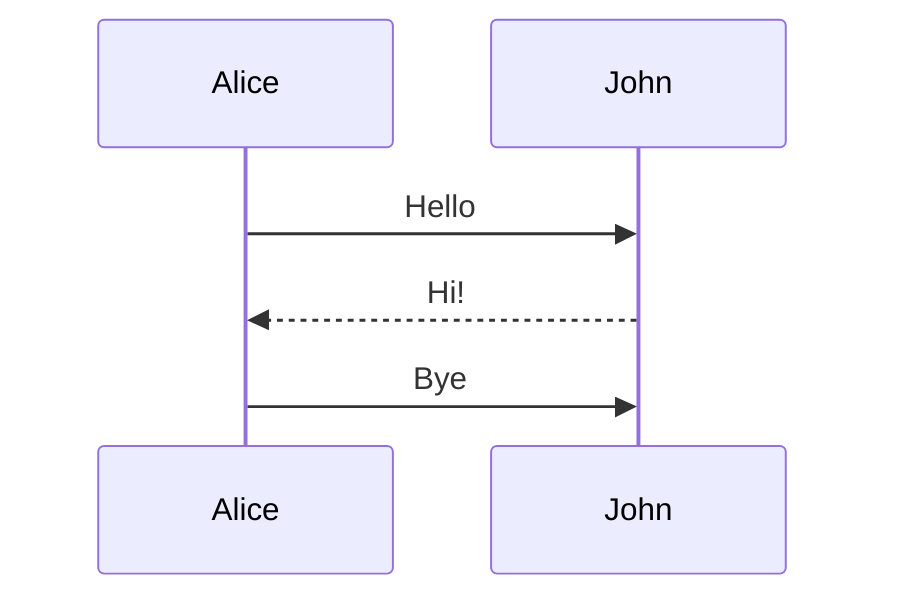
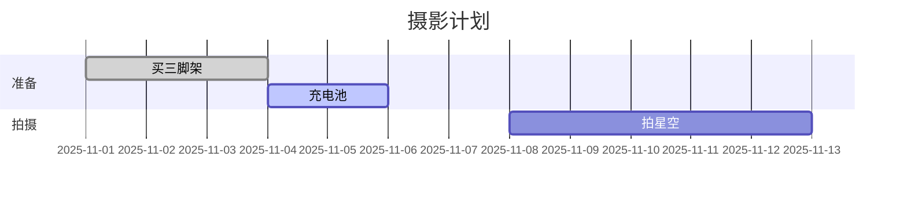
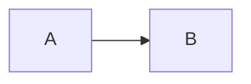

title: Markdown 全能语法备忘录
date: 2025-11-08
updated: 2025-11-09
tabs: true
math: true
shiki: true
chart: true
# Markdown 语法 & 扩展展示备忘录

## 1. 标准 Markdown 基础（VuePress 原生支持）
这些是基础中的基础，啥插件都不用。

### 标题 & 强调
# 大标题 H1
## 中标题 H2
### 小标题 H3

**粗体**，*斜体*，~~删除线~~，`内联代码`。

### 列表
- 无序列表1
  - 子项
- 无序列表2

1. 有序列表1
2. 有序列表2

### 表格
| 列1 | 列2 | 列3 |
|-----|-----|-----|
| A   | B   | C   |
| X   | Y   | Z   |

### 链接 & 图片
[黄文林的GitHub](https://github.com/Windeling)

 （点我放大，photo-swipe自动搞）

{no-view} （加{no-view}禁放大）

### 代码块（基础）
```
console.log('基础代码块')
```

```js
// 带语言高亮（shiki插件提升，但原生也行）
console.log('JS 代码')
```

## 2. 任务列表（markdown-ext 或 Hope 原生）
- [x] 已完成任务（勾勾方框）
- [ ] 未完成任务

## 3. 脚注（markdown-ext）
这句有脚注[^1]，超实用。

[^1]: 脚注描述，点我跳回来。

## 4. 上标 & 下标（markdown-ext）
化学式 H~2~O，水！数学 X^2^ + Y^2^ = Z^2^。

## 5. 自定义容器（markdown-ext 或 Hope 原生）
::: tip 提示
这是一条温馨提示，绿色框。
:::

::: warning 警告
别乱删代码，不然爆炸！
:::

::: danger 危险
天打雷劈区。
:::

::: details 折叠详情
点我展开隐藏内容。
:::

::: spoiler 剧透区
黄文林其实是帅哥（markdown-ext自定义）。
:::

## 6. 数学公式（markdown-math）
行内：Euler $e^{i\pi} + 1 = 0$

块级：
$$
\int_0^1 x^2 dx = \frac{1}{3}
$$

## 7. 选项卡（tabs，Hope 自带）
::: tabs

@tab Vue 🍏
```vue
<script setup>
console.log('Vue 牛逼')
</script>
```

@tab React ⚛️
```tsx
function App() {
  return <div>React 也好</div>
}
```

@tab Svelte 🔥
```svelte
<script>
  let name = 'Svelte'
</script>
<h1>Hello {name}!</h1>
```

:::

（点切换，手机滑，记住上次选）

## 8. 代码选项卡（Hope 自带 code-tabs）
::: code-tabs

@tab pnpm
```bash
pnpm add vue
```

@tab npm
```bash
npm i vue
```

@tab yarn
```bash
yarn add vue
```

:::

## 9. 样式化文字（markdown-stylize）
*推荐* 用这个，*必须* 带电池！doesn't work（n't红字）。VuePress ==超牛逼==（荧光高亮）。

## 10. 高级代码高亮（shiki）
```ts
// 悬浮看类型！
const user = { name: "黄文林", age: 18 }
console.log(user.name.toUpperCase())
//    ^?
```

```js
// 行号 + 高亮2/4行
console.log("1")
console.log("2 !!")  // 橙色高亮
console.log("3")
console.log("4 ==")  // 黄色高亮
```

```diff
- 旧代码：bug多
+ 新代码：丝滑
  不变行
```

（shiki带行号、diff红绿、单词高亮、TS悬浮）

这些就是你能直接在md里玩的全部花样了！插件原生混着用，写笔记教程摄影说明超爽。忘啥了随时加例子，扔给我我帮你补。继续肝下一个？ 😎

嘿哥们，懂了！这次我给你一份 **“Markdown 终极备忘录”**，**只展示能在 md 里直接写的标记**，能产生视觉/交互效果的，全都塞进一篇 md 里，**带例子 + 效果预览**！

排除纯后台插件（export-pdf、feed、social-share、notice、copyright、append-date），只留：

- **Hope 原生**：标题、列表、表格、代码块、引用、emoji、自定义容器等  
- **photo-swipe**：图片放大 + `no-view`  
- **markdown-math**：公式 `$...$` `$$...$$`  
- **tabs**（Hope 自带）：`::: tabs`  
- **markdown-ext**：脚注、上标、下标、GFM 任务列表、自定义容器  
- **markdown-stylize**：`*推荐*` → 徽章、`==高亮==` → mark  
- **shiki**：代码高亮 + 行号 + diff + twoslash  
- **@vuepress/plugin-markdown-chart**：流程图、时序图、甘特图等（Mermaid）

---

### 终极 Markdown 模板（直接复制建 `markdown-cheatsheet.md`）

```markdown
---
title: Markdown 全能语法备忘录
description: 黄文林的 VuePress 站点，Markdown 能写的全在这了！一篇顶十篇！
date: 2025-11-08
updated: 2025-11-09
tabs: true
math: true
shiki: true
chart: true
---

# Markdown 全能语法备忘录

> 一篇在手，样式我有！  
> 所有能**直接写在 md 里**产生效果的语法全在这了，带例子 + 效果说明。

---

## 1. 基础语法（VuePress/Hope 原生）

| 语法 | 例子 | 效果 |
|------|------|------|
| **加粗** | `**粗体**` | **粗体** |
| *斜体* | `*斜体*` | *斜体* |
| ~~删除线~~ | `~~删除线~~` | ~~删除线~~ |
| `行内代码` | `` `code` `` | `code` |
| [链接](url) | `[黄文林](https://windeling.com)` | [黄文林](https://windeling.com) |
| > 引用 | `> 引用` | > 引用 |
| 分隔线 | `---` | --- |
| 表情 | `:smile:` | :smile: |
| 任务列表 | `- [x] 已完成` | - [x] 已完成 |

---

## 2. 图片（photo-swipe）

```md


{no-view}
```

- **效果**：点图 → 全屏放大、滑动、缩放、下载  
- **禁放大**：加 `{no-view}`

---

## 3. 数学公式（markdown-math）

```md
行内：$e^{i\pi} + 1 = 0$

块级：
$$
\int_0^\infty e^{-x^2} \, dx = \frac{\sqrt{\pi}}{2}
$$
```

---

## 4. 选项卡（Hope tabs）

```md
::: tabs

@tab:active Vue 🍏
```vue
<script setup>
console.log('Vue 牛逼')
</script>
```

@tab React ⚛️
```tsx
function App() { return <div>React 也好</div> }
```

@tab Svelte 🔥
```svelte
<script> let name = 'Svelte' </script>
<h1>Hello {name}!</h1>
```

:::
```

---

## 5. 扩展语法（markdown-ext）

### 脚注
```md
VuePress 超强[^1]，Hope 更牛[^2]。

[^1]: 静态站点神器
[^2]: 黄文林的最爱
```

### 上标 & 下标
```md
H~2~O 是水，X^2^ 是平方
```

### 任务列表（GFM）
```md
- [x] 拍星空
- [ ] 喝奶茶
- [ ] 肝笔记
```

### 自定义容器
```md
::: tip 温馨提示
三脚架必须带！
:::

::: warning 危险
别乱删代码！
:::

::: info 信息
Waline 评论已开启
:::

::: spoiler 剧透（点击展开）
黄文林是帅哥
:::
```

---

## 6. 样式化文字（markdown-stylize）

```md
*推荐* 使用三脚架，*必须* 带电池！

Setting this *doesn't* work.

VuePress ==超牛逼==！
```

- **效果**：
  - *推荐* → <Badge type="tip">推荐</Badge>
  - *必须* → <Badge type="danger">必须</Badge>
  - *doesn't* → <span style="color:red">doesn't</span>
  - ==超牛逼== → <mark style="background:#ff0">超牛逼</mark>

---

## 7. 代码高亮（shiki）

```ts twoslash
// 悬浮看类型！
const user = { name: "黄文林", age: 18 }
console.log(user.name.toUpperCase())
//    ^?
```

```js {2,4} showLineNumbers
console.log("第1行")
console.log("第2行 !!")   // 高亮
console.log("第3行")
console.log("第4行 ==")   // 高亮
```

```diff
- 旧代码：有 bug
+ 新代码：已修复
  保持不变
```

---

## 8. 图表（@vuepress/plugin-markdown-chart / Mermaid）







---

## 9. 表格（Hope 原生 + 对齐）

```md
| 功能       | 插件             | 标记示例             |
|------------|------------------|----------------------|
| 公式       | markdown-math    | `$E=mc^2$`           |
| 选项卡     | Hope tabs        | `::: tabs`           |
| 图片放大   | photo-swipe      | ``      |
| 流程图     | markdown-chart   | ```mermaid
```

| 功能       | 插件             | 标记示例             |
|------------|------------------|----------------------|
| 公式       | markdown-math    | `$E=mc^2$`           |
| 选项卡     | Hope tabs        | `::: tabs`           |
| 图片放大   | photo-swipe      | ``      |
| 流程图     | markdown-chart   | ```mermaid

---

## 10. 禁用某页（frontmatter）

```yaml
---
math: false     # 关公式
tabs: false     # 关选项卡
shiki: false    # 关高亮
chart: false    # 关图表
---
```

---

## 总结：一键复制模板

```markdown
---
title: 我的笔记
math: true
tabs: true
chart: true
---

# 标题


行内公式 $x^2$，块级：
$$
y = ax^2 + b
$$

::: tabs
@tab JS ```js
@tab TS ```ts twoslash const a = 1 // ^? ```
:::

*推荐*，==高亮==，H~2~O


```

---

**完事！**  
把这篇扔进 `/doc/markdown-cheatsheet.md`，以后写笔记直接 `Ctrl+F` 搜语法，**再也不忘**！

想加 **语音朗读**？**AI 摘要**？**暗黑专属样式**？继续问，我接着肝！  
现在你 Markdown 水平 ≥ 99% 开发者！🚀
```